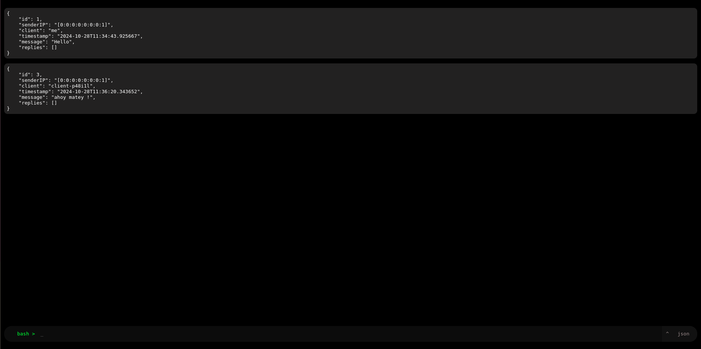
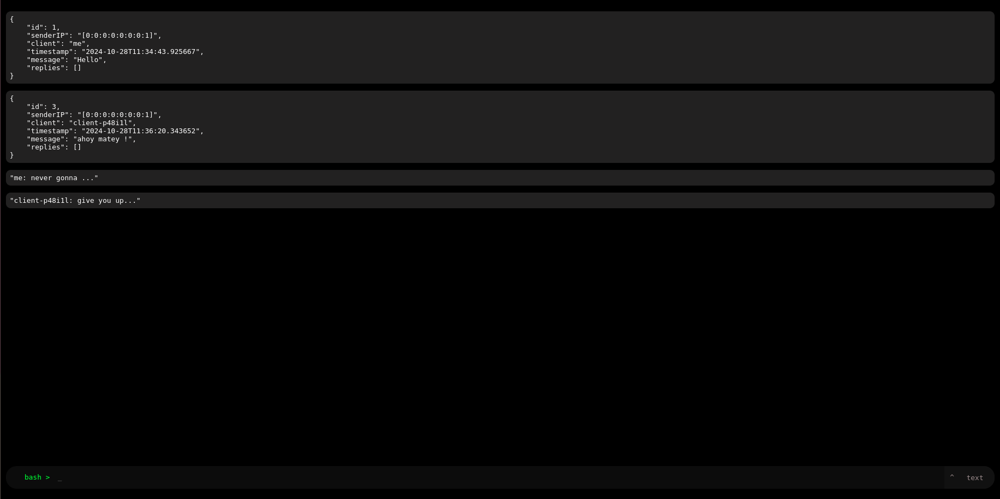
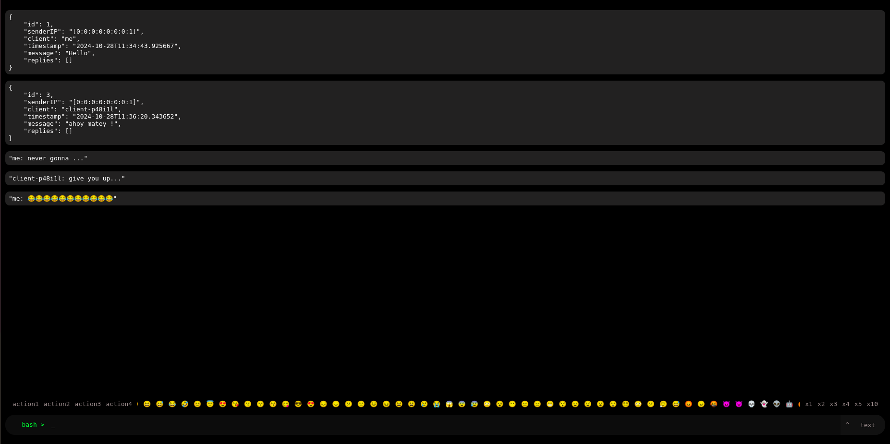

## Localhost:Chat

#### This project was started as a joke, with aim of monitoring free chat in a local environment, with in a small team or group. Now it is a fully functional project with aim of easy, reliable and near-anonymous chat. 

### It features:
* **Self deployment & hosting**
* **No login or identification.** 
* **No username, you can't see yours either.**
* **Minimal UI, similar to bash terminal.**
* **Chat messages in JSON format by default.**

----

#### View and feel:
* Main screen  
    
* Sending and receiving text    
    
  
* Emoji and multiplier  
    
  

----

#### New updates:
* **Emoji support added, can use upto 50 emojis**
* **Added multiplier for emojis, reducing burden of unnecessary click**
* **Added a button to hide and show action, emoji and multiplier bar** [Marked for further changes, which may break backward compatibility]
* **Added key listener to "/" to show action suggestions** [Actions not working yet]
---

#### Known bugs:
* Message ID skipping 1
* IP address of each client is localhost

----

#### Last update
* Scroller to switch between JSON and text format
* Button to show and hide emoji bar (partially in development)
* "Bash >" changes color according to connection status